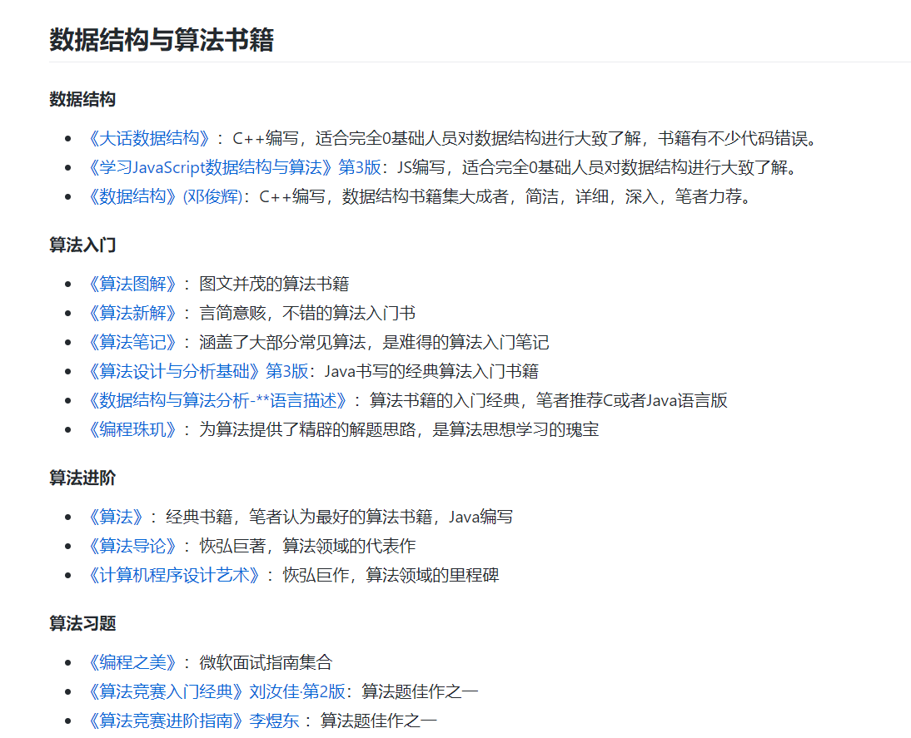
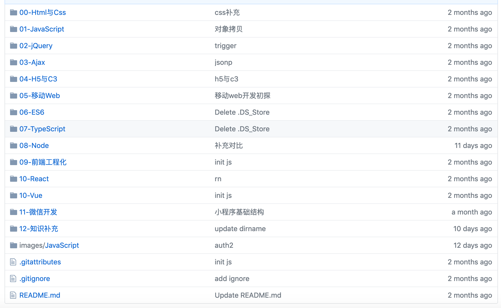

## 前言

前因编程书籍之良莠不齐，又见博文分享之杂乱无章，故愤而编此册。  

余深感道阻且长，故披荆斩棘于月下，历半载之功，初见端倪，虽形神俱疲，但乐在其中。   

今整理如图所示： 

余亦深虑己之不足，而学无涯，尚有大量文章等待校正，余必晨兢夕厉，持之以恒。  

## 书籍索引

#### 通用书籍

- [数据结构与算法](https://github.com/ruyuejun/polaris/blob/master/currency/algorithm.md)：从入门到进阶涉及到的全部数据结构，算法书籍推荐合集
- [计算机五巨头](https://github.com/ruyuejun/polaris/blob/master/currency/sixg.md)：计算机组成原理，操作系统，计算机网络，算法与程序设计，编译原理
- [软件工程与架构](https://github.com/ruyuejun/polaris/blob/master/currency/project.md)：包括设计模式，敏捷开发，项目管理，微服务等
- [服务端工具](https://github.com/ruyuejun/polaris/blob/master/currency/server.md)：包括服务端常用工具：mysql，redis，nginx，haddoop等
- [考研教材与资料](https://github.com/ruyuejun/polaris/blob/master/currency/postgraduate.md)：包括计算机，数学，英语，政治等考研所需资料

#### 编程语言书籍

- [Java](https://github.com/ruyuejun/polaris/blob/master/language/java.md)：包括Java基础，JavaWeb，Java框架等
- [JavaScript](https://github.com/ruyuejun/polaris/blob/master/language/javascript.md)：包括网页开发，JS语言，Node三类书籍
- [Go](https://github.com/ruyuejun/polaris/blob/master/language/golang.md)：市面上经典Go书整合
- [Python](https://github.com/ruyuejun/polaris/blob/master/language/python.md)：市面上经典Python书整合
- [Rust](https://github.com/ruyuejun/polaris/blob/master/language/rust.md)：市面上经典Rust书整合

## 笔记索引

[推荐书籍](https://github.com/ruyuejun/polaris)：综合了所有技术对应的书籍与书评 https://github.com/ruyuejun/polaris  

[知识笔记汇总仓库](https://github.com/overnote)：所有技术笔记所在组织 https://github.com/overnote   

对上述仓库的分类索引：  
- [Server](https://github.com/overnote/server)：包含常用服务端技术：Nginx、mysql、redis、mongodb、linux系统等
- [数据结构与算法](https://github.com/overnote/algorithm)：数据结构与算法笔记，主讲Go版本，另附JS，Java版本，未来可能增加C版
- [JavaScript](https://github.com/overnote/javascript)：包含网页、JS、前端工程化、Node、vue、react等JS相关领域技术
- [Go](https://github.com/overnote/golang)：详尽的Go领域笔记，包括语法、并发编程、web编程、微服务等
- [Java](https://github.com/overnote/java)：整理中，Java篇幅过大，整理困难，可能会鸽
- [Python](https://github.com/overnote/python)：整理中
- [计算机五巨头](https://github.com/overnote/five-x)：整理中，将包括：微机原理，操作系统，计算机网络，编译原理，数据结构与程序设计，数据库，考研数学，英语，政治等

截图如下：

## 工具索引

- [常用工具](https://github.com/ruyuejun/polaris/blob/master/toolsite/tools.md)：

## 网站索引

- [常用网站](https://github.com/ruyuejun/polaris/blob/master/toolsite/sites.md)：
